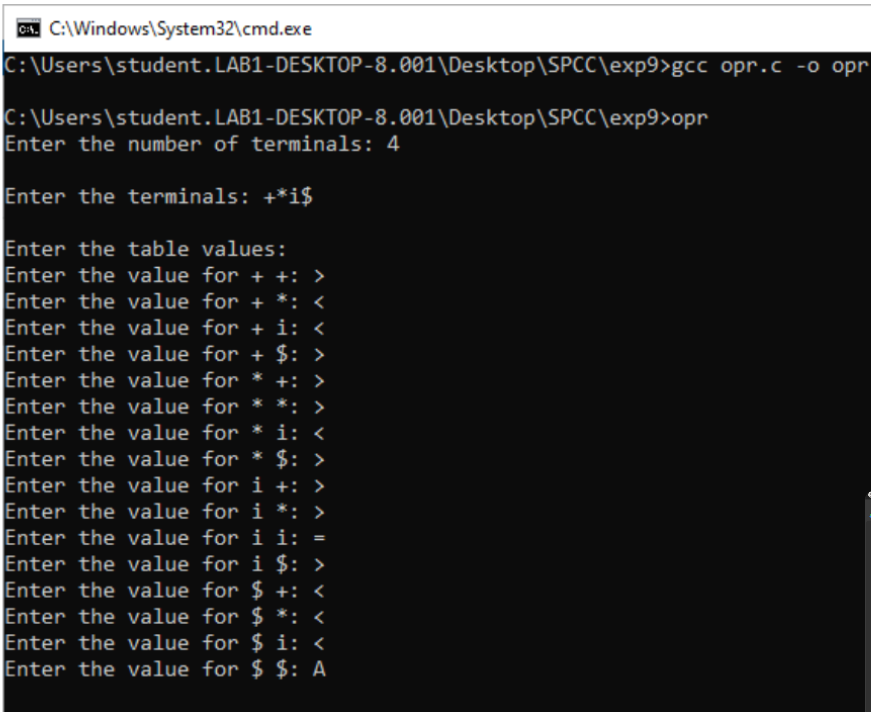

### Operator code precedence

1. opr.c
```c
#include <stdio.h>
#include <string.h>

void main() {
    char stack[20], ip[20], opt[10][10][2], ter[10];
    int i, j, k, n, top = 0, col, row;

    for (i = 0; i < 10; i++) {
        stack[i] = '\0'; // Use '\0' to represent null character
        ip[i] = '\0';
        for (j = 0; j < 10; j++) {
            opt[i][j][0] = '\0';
            opt[i][j][1] = '\0';
        }
    }

    printf("Enter the number of terminals: ");
    scanf("%d", &n);
    printf("\nEnter the terminals: ");
    scanf("%s", ter);

    printf("\nEnter the table values:\n");
    for (i = 0; i < n; i++) {
        for (j = 0; j < n; j++) {
            printf("Enter the value for %c %c: ", ter[i], ter[j]);
            scanf("%s", opt[i][j]);
        }
    }

    printf("\nOPERATOR PRECEDENCE TABLE:\n");
    for (i = 0; i < n; i++) {
        printf("\t%c", ter[i]);
    }
    printf("\n");
    for (i = 0; i < n; i++) {
        printf("%c\t", ter[i]);
        for (j = 0; j < n; j++) {
            printf("\t%c", opt[i][j][0]);
        }
        printf("\n");
    }

    stack[top] = '$';
    printf("\nEnter the input string: ");
    scanf("%s", ip);

    i = 0;
    printf("\nSTACK\t\t\tINPUT STRING\t\t\tACTION\n");
    printf("\n%s\t\t\t%s\t\t\t", stack, ip);
    
    while (i <= strlen(ip)) {
        for (k = 0; k < n; k++) {
            if (stack[top] == ter[k])
                col = k;
            if (ip[i] == ter[k])
                row = k;
        }

        if ((stack[top] == '$') && (ip[i] == '$')) {
            printf("String is accepted");
            break;
        } else if ((opt[col][row][0] == '<') || (opt[col][row][0] == '=')) {
            stack[++top] = opt[col][row][0];
            stack[++top] = ip[i];
            printf("Shift %c", ip[i]);
            i++;
        } else {
            if (opt[col][row][0] == '>') {
                while (stack[top] != '<') {
                    --top;
                }
                top = top - 1;
                printf("Reduce");
            } else {
                printf("\nString is not accepted");
                break;
            }
        }
        printf("\n");
        for (k = 0; k <= top; k++) {
            printf("%c", stack[k]);
        }
        printf("\t\t\t");
        for (k = i; k < strlen(ip); k++) {
            printf("%c", ip[k]);
        }
        printf("\t\t\t");
    }
}
```

2. Input while running


3. Input string
```
i+i*i$
```
4. Steps to run
```sh
gcc opr.c -o opr
```

```sh
opr.exe
```
